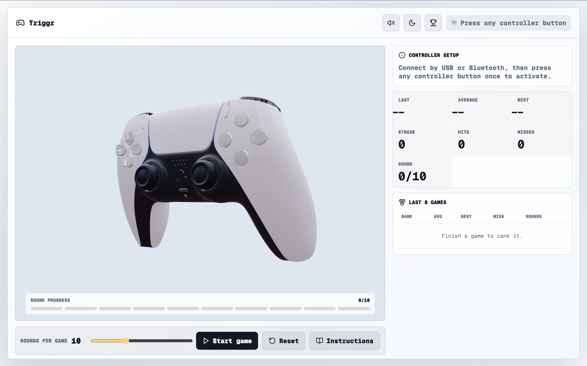

# Triggr Reaction Arena

Triggr is a controller-first reaction speed game built with TanStack React, React Three Fiber, Three.js, and the browser Gamepad API. Prompts appear after a variable delay, the player hits the matching controller or keyboard input, and the app tracks reaction speed, misses, streaks, group performance, and recent game summaries.

[Play Triggr](https://triggr-reaction.vercel.app/)



## Features

- 3D floating controller scene using `public/models/dualshock.glb`
- Browser Gamepad API support for face buttons, D-pad, shoulders, and triggers
- Game modes: Classic, Full Pad, D-pad Drill, Shoulder / Trigger Drill, and Custom Mix
- Custom Mix selection for choosing exactly which button groups appear in a run
- Controller setup modal with connection guidance, detected controller name, button mapping, and button test feedback
- Keyboard fallback for every supported prompt, so the game can be tested without a controller
- Random 0.8-2.6s prompt delay to reduce anticipation
- 2.5s reaction timeout, wrong-button misses, and false-start misses
- Reaction grades: Fast under 220ms, Good under 400ms, Slow above 400ms
- Live stats for last reaction, average, best, streak, hits, misses, and round progress
- Group performance panel with best and weakest button groups
- Last 3 game summaries with mode, groups, accuracy, average, best, misses, rounds, and top-3 medal ranking
- Streak celebration copy and Kahoot-like reaction sounds
- Dark/light theme toggle with persisted preference
- Persisted mode, rounds, sound, theme, and Custom Mix groups
- Scroll-contained right rail and compact live stats for dense desktop/mobile layouts
- Centralized UI copy in `src/copy.ts`
- Reusable design tokens in `src/styles.css` and typed 3D/game constants in `src/constants.ts`

## Tech Stack

- Vite
- React 18
- TypeScript
- TanStack Router
- React Three Fiber
- Drei
- Three.js
- Lucide React
- Web Audio API
- Browser Gamepad API

## Getting Started

Install dependencies:

```bash
npm install
```

Run the local dev server:

```bash
npm run dev
```

Open the local URL printed by Vite, usually:

```text
http://localhost:5173/
```

Build for production:

```bash
npm run build
```

Run strict TypeScript checks:

```bash
npm run typecheck
```

## How To Play

1. Connect a controller by USB or Bluetooth.
2. Focus the browser tab and press any controller button once so the browser exposes the gamepad.
3. Choose a mode and set 5-20 rounds.
4. Open Controller Setup if you want to test what the browser detects before playing.
5. Start the game.
6. When a prompt appears, press the matching controller button or keyboard fallback before the 2.5s timeout.

## Button Mapping

Triggr follows the standard browser gamepad mapping:

| Browser button index | Prompt |
| -------------------- | ------ |
| `0`                  | Cross |
| `1`                  | Circle |
| `2`                  | Square |
| `3`                  | Triangle |
| `4`                  | L1 |
| `5`                  | R1 |
| `6`                  | L2 |
| `7`                  | R2 |
| `12`                 | D-pad Up |
| `13`                 | D-pad Down |
| `14`                 | D-pad Left |
| `15`                 | D-pad Right |

Keyboard fallback:

| Group | Keys |
| ----- | ---- |
| Face | `X`, `O`, `S`, `T` |
| Shoulder | `Q`, `E` |
| Trigger | `A`, `D` |
| D-pad | Arrow keys |

## Project Structure

```text
src/
  main.tsx                       TanStack Router entrypoint
  App.tsx                        Game orchestration and main arena composition
  copy.ts                        User-facing copy enum and message builders
  constants.ts                   Button metadata, colors, storage keys, preferences, and game limits
  gameUtils.ts                   Timing, grading, prompt, sound cue, and group helpers
  hooks/
    useGamepad.ts                Gamepad polling and connection state
    useGameState.ts              App state and gameplay refs
    useReactionSounds.ts         Web Audio reaction cues
    useSavedPreferences.ts       Persisted preference loading
  components/
    ControllerScene.tsx          3D controller scene and float motion
    GameHistory.tsx              Last 3 games panel
    GameModeSelector.tsx         Mode and Custom Mix controls
    GroupPerformancePanel.tsx    Best/weakest group stats
    LiveStats.tsx                Compact scrollable live stats
    PromptCardOverlay.tsx        Animated prompt cards
    RoundProgressTracker.tsx     In-game progress tracker
    RoundTable.tsx               Current run table
    modals/
      ControllerSetupModal.tsx   Connection help, mapping, and button test
      InstructionPanel.tsx       Scrollable instructions modal
      RoundTableModal.tsx        Current run modal
  styles.css                     Theme tokens, layout, and animation polish
  animationVocabulary.ts         Shared animation class names
skills/
  animation-vocabulary.md        Motion glossary used by the UI
public/
  images/app-ss.png              README and social preview screenshot
  models/dualshock.glb           Active controller model
```

## Browser Notes

Browsers only expose gamepads after a user gesture. If a controller is already connected but Triggr says to press a button, click or focus the page and press any controller button once.

Different controllers can label buttons differently at the OS level. Use the Controller Setup modal's button test to confirm what the browser detects before starting a run.

## Development Notes

- Keep visible copy in `src/copy.ts`; avoid hardcoding UI strings in components.
- Keep colors in CSS variables or the typed `COLORS` object.
- Keep storage keys and default preferences in `src/constants.ts`.
- Keep app state initialization in `src/hooks/useGameState.ts`.
- Use `npm run typecheck` and `npm run build` before handing off changes.

## Contribution

PRs are welcome.
